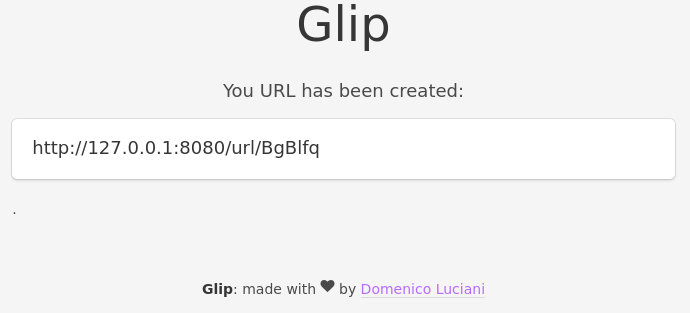

# Glip

### Your clipboard on the internet

Glip allows you to share between two devices data in a clean and easy way. [Read the article](https://domenicoluciani.com/2016/12/05/glip.html)

You can choose which unique url use and to save datas in it, after that you can share your own link with everybody and once that the link has been open... *POFF*! All datas in that url will be destroy forever.

## Example

1. site.com/url/your+unique+url
2. Save datas in it 
3. share site.com/url/your+unique+url
4. visit site.com/url/your+unique+url
5. copy your datas

Done, after that site.com/url/your+unique+url will be empty again

## Demo

http://glip.domenicoluciani.com

## How it is made ?

* Go
* SQLite
* Iris Framework
* Free time

## Install

`go get -u`

`go build`

`./Glip -p 8080`

## Screens

## Future

* Dockerfile
* Better front-end
* From SQLite to NoSQL database (?)

## Author

Domenico "DLion" Luciani

[https://domenicoluciani.com](https://domenicoluciani.com)

## License
MIT
